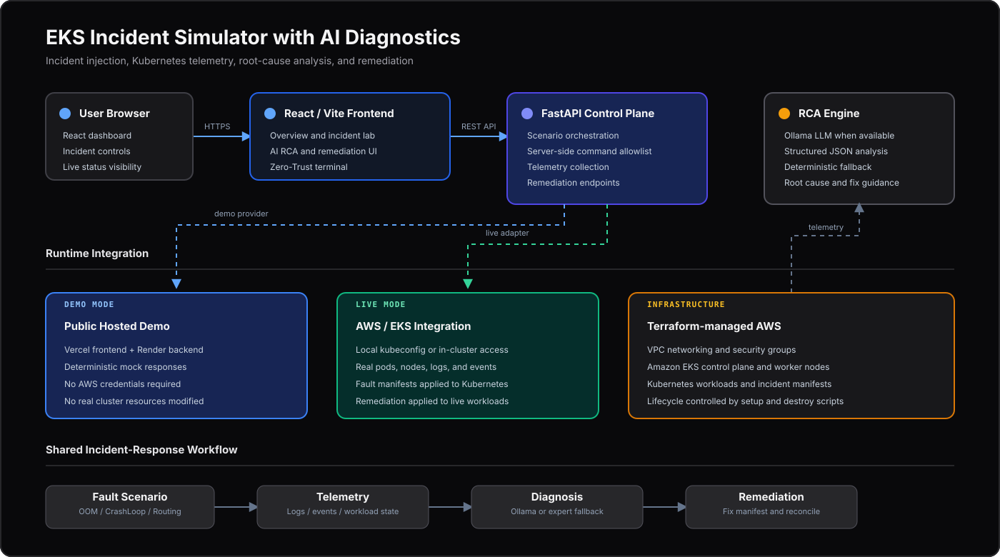

# EKS Incident Simulator with AI Diagnostics


A cloud engineering tool that provisions an Amazon EKS cluster via Terraform, injects failure scenarios into live Kubernetes workloads, and streams cluster telemetry to a local LLM for real-time Root Cause Analysis (RCA).

> 🔗 **Live demo:** [your-hosted-url-here](#) — runs in Demo Mode, nothing to install, no AWS access needed.
> Want to run it yourself instead? See "Run It Yourself" below.

---

## 🛠 Tech Stack

| Category | Technologies |
| :--- | :--- |
| **Cloud Infrastructure** |   |
| **Infrastructure as Code** |  |
| **Container Orchestration** |  |
| **Backend & AI Engine** |    |
| **Frontend Management UI** |    |
| **Automation** |  |

---

## 🏗 System Architecture

<p align="center">
  
</p>

> The hosted app is the same code either way — only the right-hand side changes. In **Demo Mode** it's replaced with realistic mock data; in a **full deployment** it's a real Amazon EKS cluster reached through your AWS credentials.

### Component Architecture Breakdown

| Layer | Subsystem | Technology Stack | Core Responsibility |
| :--- | :--- | :--- | :--- |
| **Client UI** | Management Dashboard | React 18, Vite, Tailwind CSS | Real-time incident trigger, cluster visualization, & AI diagnostic report view |
| **Control Layer** | API Orchestration | Python 3.11, FastAPI, K8s SDK | Asynchronous failure manifest injection, log collection, & diagnostic formatting |
| **Intelligence** | LLM Engine | Ollama (Llama 3 / DeepSeek) | Self-hosted, zero-cost Root Cause Analysis with deterministic fallback handling |
| **Target Cloud** | Managed Kubernetes | AWS VPC, Amazon EKS, Terraform | Production-grade K8s infrastructure subject to active fault scenario injection |

---

## 📸 Screenshots

<!-- Replace with real screenshots/GIF before publishing: dashboard overview, an active incident, and the AI RCA panel with the recommended fix. -->
| Dashboard Overview | AI Root Cause Analysis |
| :---: | :---: |
| _screenshot coming_ | _screenshot coming_ |

---

## 💡 Key Capabilities

- **Automated Infrastructure:** Multi-AZ VPC and Amazon EKS cluster lifecycle managed via modular Terraform manifests.
- **Incident Injection Engine:**
  - `01-oomkilled`: Allocates memory stress pods exceeding resource limits to force Kubernetes evictions.
  - `02-crashloop`: Deploys pods referencing non-existent secrets to simulate crash loops.
  - `03-broken-routing`: Applies mismatched label selectors in Service specs to isolate workloads.
- **Dynamic AI RCA:** Extracts real-time pod status, system events, and stdout/stderr logs from EKS and sends context to a local Ollama instance for diagnostic parsing — with a deterministic expert-system fallback so a diagnosis is always returned, even if the LLM is unreachable or returns a malformed response.
- **Zero-Trust Diagnostic Terminal:** A restricted command shell for read-only cluster inspection (`kubectl get/describe/logs`, etc.), enforced server-side by a regex allowlist and a blocked-character filter — not just UI-level restrictions.
- **Demo Mode:** The entire platform (frontend, backend, and RCA engine) runs against realistic mock data with zero AWS dependency, so anyone can evaluate the tool without provisioning cloud infrastructure.
- **Lifecycle Safety:** Bash orchestration (`setup.sh` and `destroy.sh`) to automate cluster setup and safely purge workloads before running `terraform destroy`.

---

## 🔧 Engineering Highlights & Improvements

1. **IAM Permissions Cleanup:** Removed unused AWS Bedrock IAM policies from Terraform configurations to adhere strictly to the Principle of Least Privilege (PoLP) — infrastructure now only grants what the running code actually uses.
2. **API Payload Alignment:** Standardized API response schemas across FastAPI endpoints (including both the LLM and fallback RCA paths) to ensure reliable UI state rendering during asynchronous cluster mutations.
3. **CORS Optimization:** Implemented explicit, credential-safe CORS middleware on FastAPI to handle cross-origin communications from the frontend.
4. **Reliable Teardown Automation:** Built workload-purging mechanisms into `destroy.sh` to remove active Kubernetes resources before destroying infrastructure, preventing hanging AWS Elastic Network Interfaces (ENIs).

---

## 🧭 Architecture Decisions & Trade-offs

- **Local LLM (Ollama) over AWS Bedrock:** The RCA engine intentionally targets a self-hosted Ollama model instead of a managed cloud LLM. This keeps the demo free to run repeatedly with no per-token cost and no extra IAM surface, at the cost of depending on local compute for AI-quality diagnostics. The fallback expert-system engine exists specifically to make this trade-off safe — a real diagnosis is always returned either way.
- **Demo Mode as a first-class path:** `DEMO_MODE` is checked at the same point in the code as a live cluster-connection failure, so the mock and real paths share the exact same API contract. This was a deliberate choice so anyone visiting the hosted app gets the identical UI and RCA experience as a real AWS deployment.

---

## 🚀 Run It Yourself

Most people should just use the [live demo](#) above — nothing to install. These two options are for anyone who wants to run the code directly (e.g. to review it, extend it, or connect it to a real cluster).

### Option A: Demo Mode (No AWS Required)

Same mock data as the live demo, running on your own machine:

```bash
# Backend
cd backend
python3 -m venv .venv && source .venv/bin/activate
pip install -r requirements.txt
DEMO_MODE=true uvicorn app.main:app --reload --port 8000
```

```bash
# Frontend (separate terminal)
cd frontend
npm install
npm run dev
```

Open `http://localhost:5173` — everything runs against mock data, no AWS credentials required.

### Option B: Full AWS/EKS Deployment

Use this path to run the platform against a real, live Amazon EKS cluster.

#### Prerequisites
- Linux / Ubuntu / WSL environment.
- AWS CLI configured with administrator privileges.
- Terraform `>= 1.5.0`
- Node.js (v18+) & Python 3.11+
- Ollama running locally *(optional — without it, RCA automatically uses the deterministic expert-system fallback)*.

#### Step 1: Provision Infrastructure
```bash
chmod +x scripts/setup.sh scripts/destroy.sh
./scripts/setup.sh
```

#### Step 2: Backend
```bash
cd backend
python3 -m venv .venv
source .venv/bin/activate
pip install -r requirements.txt
uvicorn app.main:app --reload --port 8000
```

#### Step 3: Frontend
```bash
cd frontend
npm install
npm run dev
```

### Simulation & Diagnostic Workflow (both options)
1. **Trigger Incident Scenarios:** Select a target scenario (`OOMKilled`, `CrashLoopBackOff`, or `Broken Routing`) from the dashboard UI.
2. **Observe Cluster State:** The dashboard shows pod status transitions, eviction states, or routing failures in real time.
3. **Generate AI RCA:** Click **Analyze** on an active incident to extract logs and Kubernetes event streams, passing this context to Ollama (or the fallback engine).
4. **Review Diagnosis:** The engine returns root cause, operational impact, and a recommended fix back to the UI.

#### Tear Down (Option B only)
To clean up all AWS resources and avoid unexpected cloud charges:
```bash
./scripts/destroy.sh
```

---

## 📜 License

This project is licensed under the MIT License — see the `LICENSE` file for details.